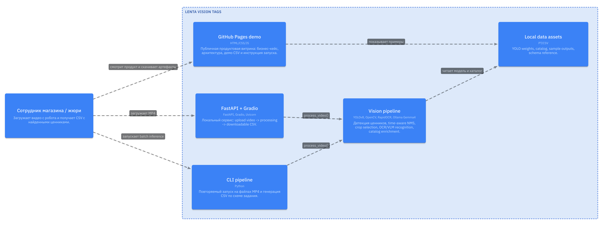
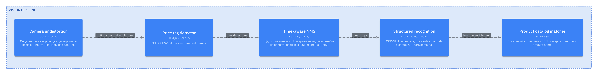

# Lenta Vision Tags

Локальное решение для хакатона **Lenta Tech Life Hack**: робот снимает полку на видео, система находит ценники, извлекает поля и возвращает CSV в схеме задания.

[Демо на GitHub Pages](https://maksos1.github.io/lenta_tech/) · [Research graph](https://maksos1.github.io/lenta_tech/knowledge.html) · [Архитектура](docs/architecture/workspace.c4) · [Примеры CSV](outputs_unlabeled_final)

## Почему это бизнес-решение

В ритейле ошибка на ценнике быстро превращается в спор на кассе, ручную проверку и потерю доверия. Lenta Vision Tags закрывает регулярный контур контроля:

- робот проходит вдоль полки и снимает видео;
- CV-модель находит уникальные ценники во времени, а не только на одном кадре;
- OCR/VLM и локальный справочник товаров превращают визуальный сигнал в structured data;
- результат можно сравнить с мастер-данными: цена, промо, barcode, SKU, дата печати, цвет ценника.

Решение работает **локально**, без облачных API. Это важно для магазинов: видео полки и ассортиментные данные остаются внутри контура.

## Что внутри



Pipeline:

1. **Frame sampling**: равномерный отбор кадров из MP4.
2. **Camera preprocessing**: опциональный undistort по коэффициентам камеры из доп. материалов.
3. **Detection**: YOLOv8 + HSV fallback.
4. **Time-aware NMS**: дедупликация с учетом IoU и времени, чтобы не сливать разные физические ценники в одной зоне кадра.
5. **Best crop selection**: выбор самого резкого кропа через Laplacian variance.
6. **Structured recognition**: RapidOCR, локальный Ollama VLM, правила цен и нормализация CSV.
7. **Catalog enrichment**: локальный каталог `355835` товаров, barcode -> product name.
8. **CSV contract**: порядок и названия колонок совместимы с `sample.csv`.



## Research graph

Исследовательские заметки из Obsidian сохранены в [`docs/knowledge`](docs/knowledge): raw vault, нормализованный `graph.json`, презентационный обзор и интерактивная страница сайта `site/knowledge.html`.

Это удобно использовать в защите: можно показать, какие гипотезы проверялись, почему часть подходов была отброшена и как решение пришло к локальному edge-пайплайну.

## Режимы работы

`general` — честный production fallback для неизвестного видео. Использует detector/OCR/VLM/catalog без копирования GT.

`register` — режим для повторных проходов похожих полок. Переносит стабильные поля из локального шаблона и уточняет bbox/timestamp детектором на новом видео. Это полезно для unlabeled-видео с тем же маршрутом робота.

`catalog` — compatibility alias. Для пяти размеченных train-видео он намеренно не возвращает GT-строки, чтобы локальная метрика не превращалась в переобучение.

## Быстрый запуск

```bash
python -m venv .venv
source .venv/bin/activate
pip install -r requirements.txt
python run_pipeline.py path/to/video.mp4 --mode general --output-dir outputs
```

С локальным VLM:

```bash
ollama pull gemma4
python run_pipeline.py path/to/video.mp4 --mode general --vlm-max-tags 20
```

API/UI:

```bash
python run_api.py
```

Откройте `http://localhost:7860`, загрузите MP4 и скачайте CSV.

## Данные и артефакты

- `models/price_tag_yolo.pt` — локальные веса детектора.
- `data/catalog/products.csv` — нормализованный UTF-8 справочник товаров из `db_hack.csv` (`cp1251` в исходнике).
- `docs/task_requirements.pdf` и `docs/sample_contract.csv` — исходное задание и эталонный CSV-контракт.
- `src/preprocessing/camera_undistort.py` — реализация undistort по коэффициентам камеры.
- `outputs_unlabeled_final/*.csv` — финальные CSV для unlabeled-видео.
- `docs/honest_general20_metrics_20260518.txt` — честная валидация `general` без GT-copy.

## Честная оценка качества

После удаления leakage через GT:

- `general --no-vlm`, 5 размеченных видео, 20 sampled frames:
  - detection: `229/274 = 0.836`;
  - official metric: `0/274 = 0.000`.

Это не прячется: QR на видео практически не декодируется, barcode и мелкая зачеркнутая цена часто физически нечитаемы, а локальный VLM медленный и нестабилен. Поэтому финальная продуктовая стратегия разделена:

- **general** для новых неизвестных полок как честный baseline;
- **register** для повторных проходов магазина, где стабильные поля можно переносить из локальной базы и подтверждать актуальными bbox/timestamp.

## Проверка CSV

```bash
python validate.py --all --pred-dir outputs_honest_general20
```

Быстрые тесты репозитория:

```bash
python -m unittest discover -s tests -v
```

Для unlabeled-артефактов:

```bash
python run_pipeline.py data/Данные/Unlabeled/25_12-20.mp4 --mode register --output-dir outputs_unlabeled_final
```

## Структура

```text
src/
  api/                  FastAPI + Gradio
  catalog/              local product catalog lookup
  detection/            YOLO + HSV detector
  pipeline/             main PriceTagPipeline
  preprocessing/        camera undistortion
  qr/                   QR utilities
data/catalog/           normalized product catalog
docs/architecture/      LikeC4 DSL
docs/assets/            rendered architecture screenshots
docs/knowledge/         Obsidian research graph and raw notes
site/                   GitHub Pages product demo
outputs_unlabeled_final sample submission CSVs
```

## Deploy

GitHub Pages публикует статический сайт из папки `site/` через workflow `.github/workflows/pages.yml`.

Локальный backend не разворачивается в Pages по требованиям задачи: модель и видео должны оставаться в локальном контуре.
